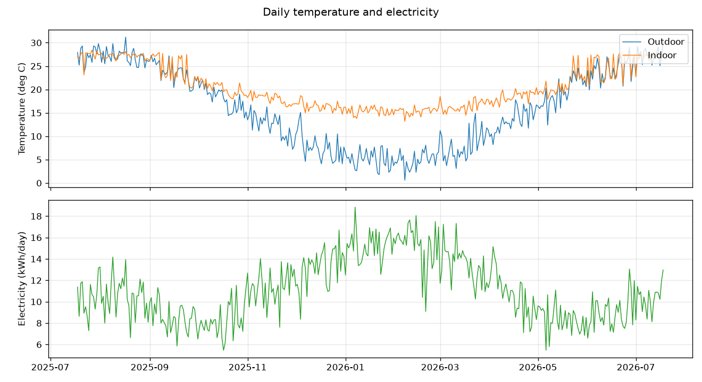
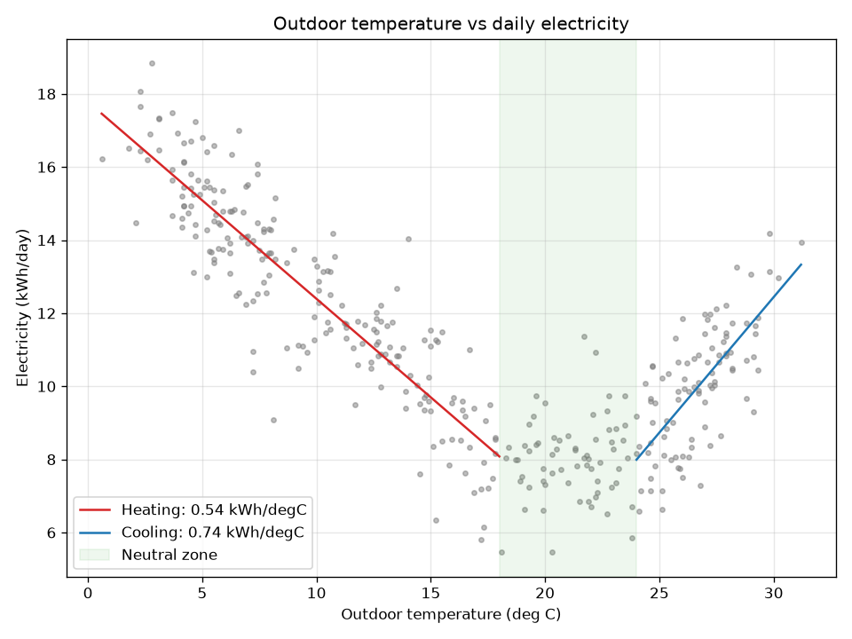
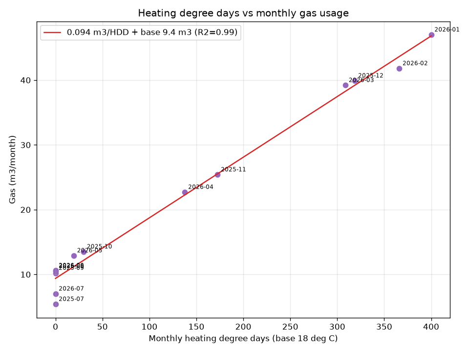

# 住環境エネルギー分析レポート

対象期間: 366日分の日次データ

## 1. 電力と気温の関係

- 外気温との相関係数: -0.71
- ベース電力（中間期 18–24°C の平均）: **8.0 kWh/日**（全消費の約72%）
- 暖房感応度（外気温が18°Cを1°C下回るごと）: **0.54 kWh/°C·日**（R²=0.80, n=206）
- 冷房感応度（外気温が24°Cを1°C上回るごと）: **0.74 kWh/°C·日**（R²=0.50, n=93）
- 年間電力量: 4,081 kWh（約126,520円 @ 31円/kWh）

## 2. ガスと暖房度日（HDD）の関係

- 月次HDDとの相関係数: 0.99
- HDD感応度: **0.09 m³/HDD**（R²=0.99, n=13）
- ベースガス（給湯・調理）: **9.4 m³/月**
- 年間ガス使用量: 286 m³（約60,081円 @ 210円/m³）

## 3. 快適性（室温）

- 快適域（18–28°C）滞在率: 61%
- 冬季（外気<18°C）の平均室温: 17.0°C
- 冬季の室内外温度差の平均: 7.5°C（大きいほど断熱・暖房が効いている）
- 冬季に室温が18°Cを下回った日数: 139日

## 4. 推奨アクション

1. ベース電力（空調に依らない待機・常時消費）が全体の約72%を占めています。冷蔵庫の設定・待機電力・照明のLED化など、空調以外の見直しが最も効きます。
2. 冷房の温度感応度（0.74 kWh/°C·日）が大きめです。日射遮蔽（すだれ・遮熱カーテン）とエアコンのフィルター清掃が有効です。
3. ガスのうち暖房起因は年間約164 m³（約34,464円）と推定されます。エアコン暖房（ヒートポンプ）への一部シフトで削減余地があります。
4. 室温が快適域（18–28°C）にある時間は約61%に留まります。健康面（WHOは冬季18°C以上を推奨）からも、省エネより先に最低室温の底上げを優先してください。

## グラフ

---

> 注: 現在は `generate_sample_data.py` によるサンプルデータでの実行結果です。実データの入れ方は `home_energy/README.md` を参照。